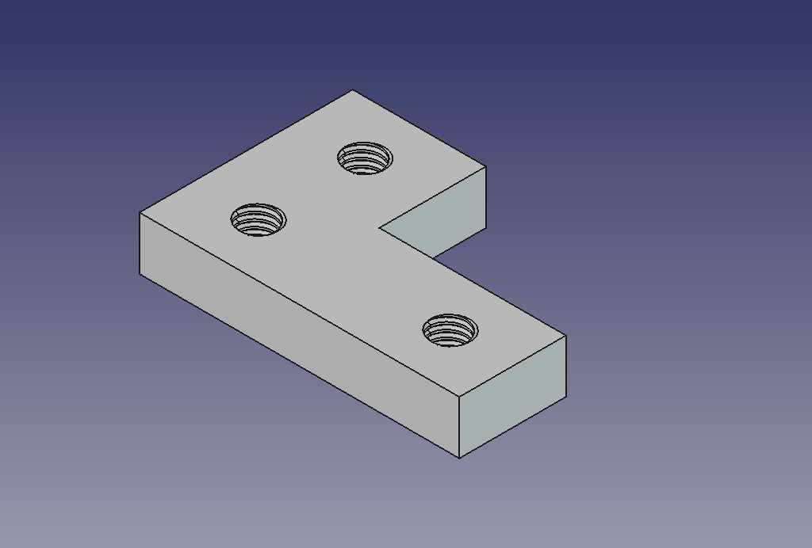
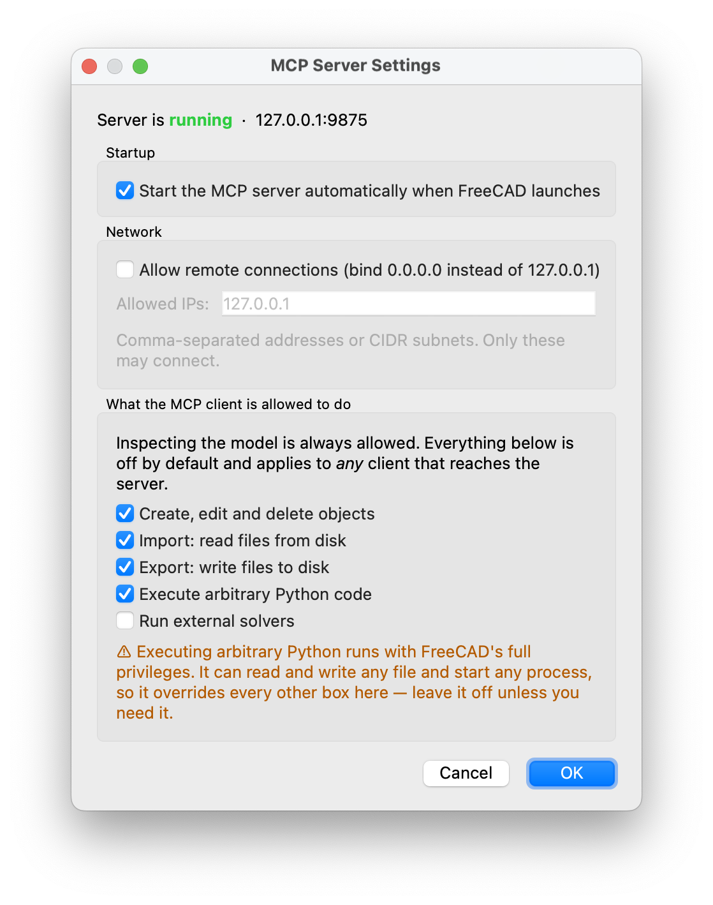

# VNS FreeCAD MCP

[](https://www.freecad.org)
[]()
[](https://modelcontextprotocol.io)
[](LICENSE)

A **fork of [neka-nat/freecad-mcp](https://github.com/neka-nat/freecad-mcp)** that lets an LLM
client — Claude Desktop, LangChain, ADK — drive FreeCAD over the Model Context Protocol.

This fork fixes several defects that made the original unreliable in practice, adds the tools
that were missing for real parametric modelling, and rebuilds the FreeCAD-side user interface.
**Every change was verified against a running FreeCAD 1.1.1**, not just against the source.



*Built with four tool calls and no hand-written Python: `create_sketch` → `create_object` (Pad) →
`create_sketch` → `create_object` (threaded Hole). Final volume 15735.72 mm³.*

---

## What this fork changes

### Defects fixed

| | Problem | Effect |
|---|---|---|
| **C0** | `serialize_shape` read `shape.Volume` unguarded | One object with a failed shape made **`get_objects` throw for the entire document** — and the built-in prompt tells the model to call `get_objects` before every task. One broken feature left it permanently blind. |
| **C1** | `create_object` returned success without checking | A `PartDesign::Pad` created outside a Body came back `success: True` while sitting `Invalid` with no shape. The model then built on geometry that did not exist. |
| **C2** | Body membership is a *method*, not a property | 71 PartDesign types were unreachable: `body.Group` cannot be set over the wire, and a feature created outside its Body fails PartDesign's scope check. |
| **C3** | `Part.LineSegment` cannot cross XML-RPC | Sketches — the basis of parametric CAD — could only be built with `execute_code`. |
| **A1** | Screenshots gated on `view.saveImage` | TechDraw pages and spreadsheets were **invisible** to the model. |

### Tools added

- **`create_sketch`** — Sketcher geometry and constraints as plain JSON. `polyline` and
  `rectangle` add their own coincident constraints, because an unclosed wire is the usual reason
  a Pad silently produces nothing.
- **`create_object` gains `body_name`** — creates a feature *inside* a PartDesign Body, advancing
  its Tip. Sketch-free primitives (`AdditiveBox`, `SubtractiveCylinder`, …) need no sketch at all.
- **File I/O** — `save_document`, `save_document_as`, `open_document`, `close_document`,
  `export_objects`, `import_file`. Format dispatch goes through FreeCAD's own registry, so all
  ~53 registered formats work (STEP, STL, BREP, OBJ, DXF, 3MF …) with no hand-written table.

### Security: capability gates

Anything that could reach port 9875 previously got the **whole** RPC surface, including
`execute_code` — arbitrary Python with FreeCAD's privileges. Five gates now sit on the RPC
boundary, **secure by default**:

| Capability | Default | Covers |
|---|---|---|
| Create, edit and delete objects | **on** | `create_object`, `edit_object`, `delete_object` |
| Import: read files from disk | off | `open_document`, `import_file`, parts library |
| Export: write files to disk | off | `export_objects`, `save_document` |
| Execute arbitrary Python | off | `execute_code`, `execute_code_async` |
| Run external solvers | off | `run_fem_analysis` (spawns CalculiX) |

Inspection is never gated — refusing `get_objects` would leave a client unable to see *why* a
call was refused. Enforcement lives in the **addon**, not the MCP server, because the addon is
the side that cannot be bypassed by another client, a script, or a remote machine.



*The gear dialog. The allowed-IP field is greyed until remote connections are enabled, and the
orange warning appears only when code execution is ticked — a permanent warning is one you learn
to ignore.*

### A rebuilt FreeCAD interface

Always visible from **any** workbench, at the far left of the top toolbar:


- **MCP On/Off** — one button replacing the old always-enabled Start/Stop pair. Red = stopped,
  green = running, amber = shutting down. Three states because the stop drains on a background
  thread: a two-state dot would say "stopped" while the socket was still bound and invite a
  restart that fails with `EADDRINUSE`.
- **Settings (gear)** — auto-start, remote connections, allowed IPs and the capability gates in
  one dialog, with the live server status and bound address.
- **Document location (folder)** — a popup menu of the front document's path, root to file; click
  any level to open it in Finder / Explorer / your file manager.

### Bugs fixed in the addon UI

**Auto-start could never be switched on.** Three independent causes:

1. FreeCAD passes `checked=0` to `Activated()` in **both** directions, so
   `settings[key] = bool(checked)` was pinned to `False` forever.
2. `QtWidgets.QAction` does not exist on PySide6 — Qt6 moved it to `QtGui`. The `AttributeError`
   was swallowed by a bare `except`, so the startup sync silently failed and the toolbar showed
   **Auto-Start ✓** while the settings file said `false`.
3. `setChecked()` re-enters the command, bouncing the state straight back.

**The settings file could be silently emptied.** `save_settings` truncated the real file before
writing, so a crash in that window left 0 bytes and every setting reverted to defaults. It now
writes to a temp file and `os.replace`s it into position.

---

## Install

### 1. The FreeCAD addon

Copy `addon/FreeCADMCP` into FreeCAD's `Mod` directory:

| OS | Path |
|---|---|
| macOS (1.1) | `~/Library/Application Support/FreeCAD/v1-1/Mod/` |
| macOS (1.0) | `~/Library/Application Support/FreeCAD/v1-0/Mod/` |
| Linux | `~/.local/share/FreeCAD/v1-1/Mod/` or `~/.FreeCAD/Mod/` |
| Windows | `%APPDATA%\FreeCAD\Mod\` |

```bash
cp -r addon/FreeCADMCP ~/Library/Application\ Support/FreeCAD/v1-1/Mod/
```

Restart FreeCAD. The **MCP** toolbar appears at the top left; click **MCP On/Off** to start the
server, or enable auto-start from the gear.

### 2. The MCP server

Released build:

```json
{"mcpServers": {"freecad": {"command": "uvx", "args": ["freecad-mcp"]}}}
```

This checkout:

```json
{"mcpServers": {"freecad": {"command": "uv",
  "args": ["--directory", "/path/to/VNS-freecad-mcp", "run", "freecad-mcp"]}}}
```

Restart the MCP client afterwards — it launches the server at startup.

Options: `--only-text-feedback` suppresses all screenshots; `--host <ip>` connects to FreeCAD on
another machine (enable **Remote Connections** and set the allowed IPs in the gear dialog first).

---

## Tools

| Tool | |
|---|---|
| `create_document` · `list_documents` · `open_document` · `save_document` · `save_document_as` · `close_document` | Document lifecycle |
| `create_object` · `edit_object` · `delete_object` | Objects, with `body_name` for PartDesign |
| **`create_sketch`** | Sketcher geometry + constraints from JSON |
| `export_objects` · `import_file` · `insert_part_from_library` | Files, ~53 formats |
| `get_objects` · `get_object` · `get_view` · `get_parts_list` | Inspection; `get_view` captures 3D, TechDraw **and** spreadsheets |
| `execute_code` · `execute_code_async` | The escape hatch, gated off by default |
| `run_fem_analysis` | CalculiX |
| `reload_document` | Pick up external file changes |

### Sketching from JSON

```json
{
  "doc_name": "Bracket", "sketch_name": "Profile", "body_name": "Body",
  "geometry": [
    {"type": "polyline",
     "points": [[0,0],[60,0],[60,20],[25,20],[25,40],[0,40]], "closed": true}
  ],
  "constraints": [
    {"type": "Coincident", "first": 0, "first_pos": "start",
                           "second": -1, "second_pos": "start"},
    {"type": "Horizontal", "first": 0},
    {"type": "DistanceX", "first": 0, "first_pos": "start",
                          "second": 0, "second_pos": "end", "value": 60}
  ]
}
```

Returns the geometry index map, `degrees_of_freedom`, `fully_constrained` and `closed_wires` —
check the last before padding, since `0` means there is no usable profile.

Geometry: `polyline`, `rectangle`, `line`, `circle`, `arc`, `ellipse`, `point`, any of them
construction. Constraints: `Horizontal`, `Vertical`, `Block`, `Coincident`, `PointOnObject`,
`Parallel`, `Perpendicular`, `Equal`, `Tangent`, `Symmetric`, `Distance`, `DistanceX`,
`DistanceY`, `Angle`, `Radius`, `Diameter`, `Weight`.

---

## Verification

```bash
python3 docs/verify_gaps.py     # exit 0 = all good, 1 = a regression
```

A regression suite that runs against a **live** FreeCAD + RPC server. It builds real geometry,
asserts the numbers, and cleans up its own scratch documents. 13/13 at time of writing.

Two things it guards that are easy to get wrong:

- **A blank capture counts as failure.** The first attempt at TechDraw support returned `True`
  and wrote a valid PNG that was entirely white. Byte count proves nothing — the *correct*
  TechDraw capture is smaller than the blank one.
- **Volumes are compared with a tolerance**, never for equality. OCCT returns
  `999.9999999999998` for a 20×10×5 box.

---

## Documentation

| | |
|---|---|
| [`docs/mcp-gap-analysis.md`](docs/mcp-gap-analysis.md) | What the MCP did not expose, classified by severity, with what was measured |
| [`docs/freecad-python-api-inventory.md`](docs/freecad-python-api-inventory.md) | FreeCAD 1.1.1's API measured by introspection: 352 object types, 76 FEM factories, 63 Draft factories, 53 export formats |
| [`docs/verify_gaps.py`](docs/verify_gaps.py) | The regression suite |
| [`version_history.md`](version_history.md) | Changelog |

---

## Credits

Forked from **[neka-nat/freecad-mcp](https://github.com/neka-nat/freecad-mcp)** — the original
architecture (the two-process split, the GUI-thread dispatch, the tool set) is theirs, and this
fork keeps it. MIT licensed, as is the original.
